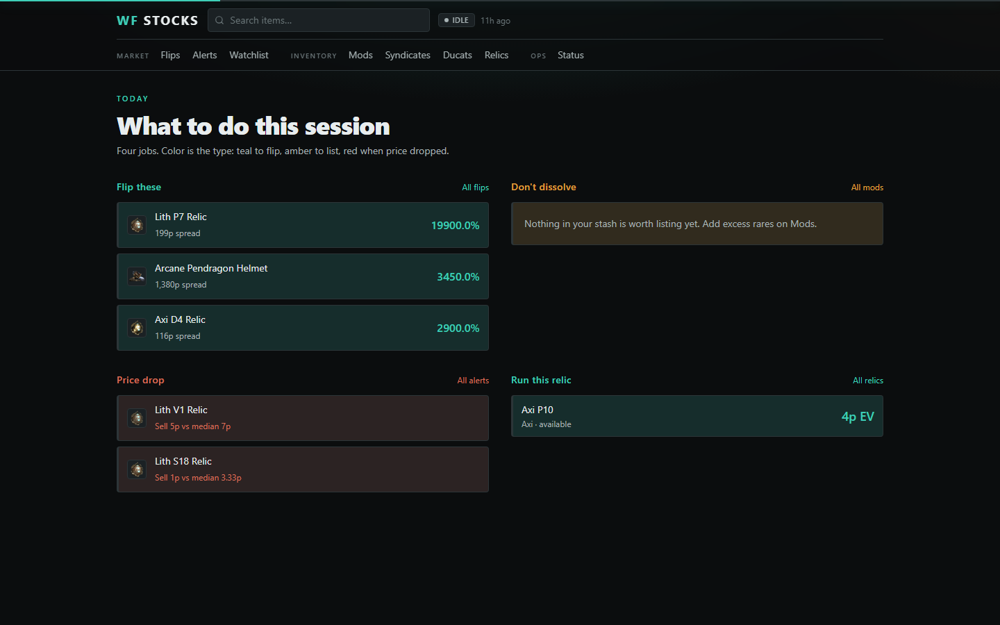
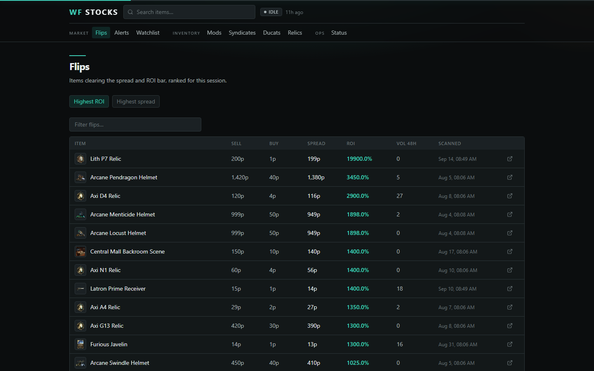
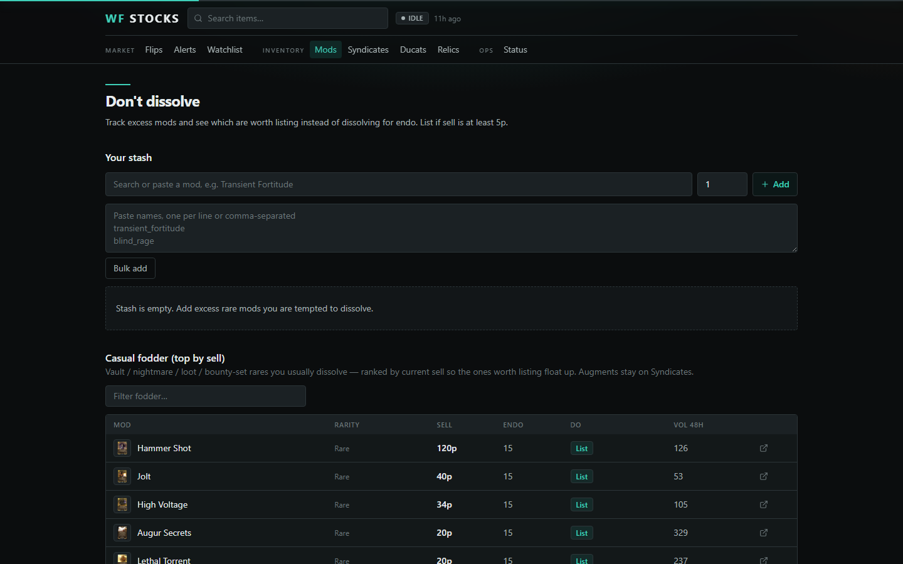
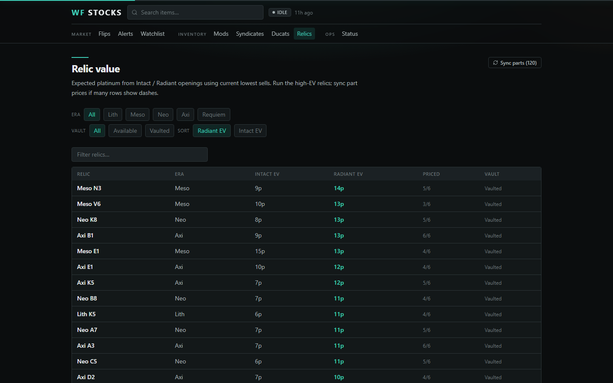

# WF Stocks

Personal Warframe.market platinum monitor. Cron scans PC orders into Supabase; the dashboard tells you what to flip, list, or run this session.

**Live:** [warframe-market-stocks.vercel.app](https://warframe-market-stocks.vercel.app)

Sign in for a private watchlist and mod stash. Market boards (flips, alerts, relics, ducats) are the shared scan.



Home is a command center, not a dump of tables. Teal is a flip, amber is “list instead of dissolve,” red is a price drop.

## Boards

**Flips** — items clearing the spread/ROI bar, ranked for the session.



**Don't dissolve** — stash + fodder rares, with a list/dissolve call.



**Relics** — Intact / Radiant expected value from current part sells.



Also: syndicate augments, ducat efficiency, alerts, watchlist, item history with a sell sparkline.

## Stack

Next.js 15 (App Router) + Tailwind · Supabase Postgres · Vercel Hobby · GitHub Actions every 4h (plus a daily Vercel cron backup)

Warframe.market **API only** (no HTML scrape): items + orders on **v2**, statistics on **v1**. Cap is 3 req/s. Scans are batched with a `scan_cursor` so a single serverless run stays short.

## Local

```powershell
npm install
copy .env.example .env.local
npm run dev
```

Fill `.env.local` from `.env.example`:

| Need | What |
|------|------|
| Supabase | `NEXT_PUBLIC_SUPABASE_URL`, `NEXT_PUBLIC_SUPABASE_ANON_KEY`, `SUPABASE_SERVICE_ROLE_KEY` |
| Cron | `CRON_SECRET` — Bearer token for `/api/cron/*` |
| WFM | `WFM_USER_AGENT` — descriptive, with a contact |

Optional scan knobs (`MIN_SPREAD`, `MIN_ROI_PCT`, …) live in `.env.example`.

Never commit `.env.local`, `SUPABASE_SERVICE_ROLE_KEY`, or `CRON_SECRET`. The anon key is public by design.

## Accounts

Email + password via Supabase Auth. Apply `supabase/migrations/` (including `user_accounts`) to the project. Signup confirms immediately so the confirm-email link is not required. If you still get a confirm mail pointing at `localhost:3000`, ignore it and **Sign in** with the same password.

## Scan

```powershell
$secret = "<CRON_SECRET from .env.local>"
Invoke-RestMethod -Method POST -Uri "http://localhost:3000/api/cron/sync-items" -Headers @{ Authorization = "Bearer $secret" }
Invoke-RestMethod -Method POST -Uri "http://localhost:3000/api/cron/scan" -Headers @{ Authorization = "Bearer $secret" }
```

Production: GitHub Actions (`APP_URL` + `CRON_SECRET` repo secrets) every 4 hours UTC. Vercel Hobby also hits `/api/cron/scan` once a day at 06:00 UTC.

Cron stays on `CRON_SECRET`. Personal lists are per account (`auth.uid()` + RLS).
